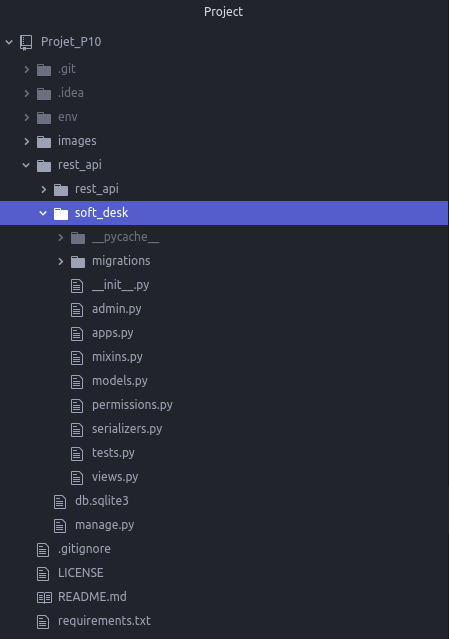
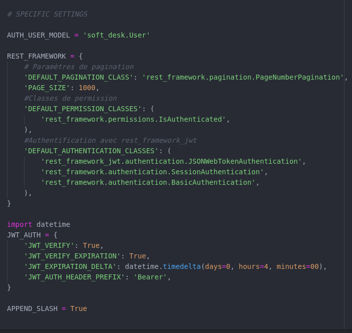

# Projet_P10
## Créer une API sécurisée RESTful en utilisant Django REST
### 1) Description de l'application

Ce projet consiste à développer une API sécurisée, pour le compte de la société SoftDesk, permettant d’accéder à une application de suivi de développement logiciel.

#### 1.1) Frameworks utilisés

* **Django** : pour le développement de sites web en Python
* **Django REST Framework** : pour concevoir des API REST avec Django

#### 1.2) Langage utilisé

* **Python** : le langage de programmation interprété, multi-paradigmes et multiplateformes (classé N° 3 à l'index TIOBE en avril 2021), pour impléter la logique de l'application

#### 1.3) Packages supplémentaires

* **djangorestframework-jwt** : package pour gérer l'authentification via des JSON Web Token (JWT)
* **drf-nested-routers** : package pour gérer la redirection vers des View Set dans des "routers" imbriqués

### 2) Architecture du projet

#### 2.1) Le projet `rest_api`

C'est le projet au sens "Django" du terme, obtenu via la commande :

`django-admin startproject rest_api`

Il correspond au dossier `rest_api` contenu dans le répertoire `Projet_P10`.

Ce projet vient avec 2 fichiers :
- `db.sqlite3`: le fichier base de données fourni par défaut
- `manage.py` : script python contenant l'ensemble des opérations d'administration du site (création d'une , modification base de données, migration pour "synchroniser" le model avec la base de données etc..)

A l'intérieur de ce dossier projet, se trouvent les applications.

#### 2.2) L'application `rest_api`

Elle est créée automatiquement lors de la création du projet `rest_api`.

Elle contient notamment les 2 fichiers :

- `settings.py` : dans lequel se trouve l'ensemble de la configuration du projet
- `urls.py` : dans lequel on définit l'ensemble des points de terminaison (endpoints) de l'api

#### 2.3) L'application `soft_desk`

C'est l'application qui héberge le code de l'API :
- `admin.py` : pour pouvoir accéder aux tables via l'administration de Django
- `models.py` : module décrivant le modèle de données
  - `User` : classe personnalisée héritant de `django.contrib.auth.models.AbstractBaseUser`
  - `Project` : classe définissant un projet
  - `Contributor` : classe définissant un contributeur
  - `Issue` : classe définissant un problème, une anomalie, une tâche dans un projet
  - `Comment` : classe définissant un commentaire posté sur un problème ou une anomalie
- `permissions.py` : ensemble de classes définissant des permissions customisées
- `serializers.py` : module contenant les classes permettant de "sérialiser" les objects de la base de données
- `views.py` : module contenant l'ensemble des classes de type ViewSet appelées par l'API

#### 2.4) Configuration du projet livré dans le repository Github

##### 2.4.1) Applications installées

##### 2.4.2) Paramétrages spécifiques

#### 2.5) GitFlow du projet

Le projet est organisé en 2 branches :

* Branche de développement : `p10_dev`
* Branche principale (version stable du projet) : `main`

### 3) Installation du projet Projet_P10 sur votre machine

Sur votre poste de travail, créer un dossier dans lequel vous allez installer le projet.

On nommera par exemple ce dossier `projects`. (vous pouvez le nommer autrement, c'est juste pour avoir une référence dans la suite des explications)

Aller sur le dépôt github : https://github.com/yannis971/Projet_P10

Pour l'installation, il y a 2 méthodes possibles.

#### 3.1) Première méthode : Téléchargement du fichier zip

Dans l'onglet **<> Code** de la page ci-dessus, cliquer sur le bouton **Code** puis sur **Download ZIP**

Placer le fichier zip dans le dossier `projects` et le dézipper.

Ouvrir un terminal et se déplacer dans la racine du projet dossier `projects/Projet_P10-main/`

Passer à l'étape 4 pour configurer l'environnement virtuel

#### 3.2) Deuxième méthode : Clonage du dépôt avec git

Sur la figure précédente, copier le lien https : https://github.com/yannis971/Projet_P10.git

Ouvrir un terminal et se déplacer dans le dossier `projects` créé précédemment et taper la commande :

`git clone` suivi du lien https copié plus haut.

soit : `git clone https://github.com/yannis971/Projet_P10.git`

Se déplacer dans la racine du projet : dossier `projects/Projet_P10`

Passer à l'étape 4 pour configurer l'environnement virtuel

### 4) Configuration de l'environnement virtuel

#### Remarque

Les commandes ci-dessous (notamment celles concernant l'installation de pip pour python3) sont valables sur un système d'exploitation Linux de type Debian ou de ses dérivés.

Pour Windows, on utilise python et pip.

Pour Mac OS, on utilise python3 et pip3.

#### 4.1) Installer pip pour python3 si ce n'est pas déjà fait

Si la commande `pip3 --version` renvoie une erreur alors il convient d'installer pip

`sudo apt-get update && sudo apt-get install python3-pip`

Si l'installation a réussi, la commande vous renverra une ligne comme indiqué ci-dessous

`pip 20.2.3 from /soft_desk/yannis/.local/lib/python3.8/site-packages/pip (python 3.8)`

#### 4.2) Créer un environnement virtuel et l'activer

Se placer à la racine du projet (dossier `projects/Projet_P10`) et lancer la commande :

`python3 -m venv env`

Une fois l'environnement virtuel  `env` créé, l'activer avec la commande :

`source env/bin/activate`

#### 4.3) Installer les dépendances du projet

Toujours à la racine du projet, lancer l'une des 2 commandes suivantes :

`pip3 install -r requirements.txt`

`python3 -m pip install -r requirements.txt`

### 5) Installation de Postman

#### 5.1) Installer Postman ou y accéder directement sur le Web

Pour installer ou utiliser Postman, suivre les instructions sur le site ci-dessous :

https://www.postman.com/downloads/

#### 5.2) Créer une collection

Créer une nouvelle collection.

Pour alimenter les endpoints de cette nouvelle collection, vous pouvez importer la collection soft_desk_api_collection que j'ai partagée publiquement via le lien ci-dessous :

https://www.getpostman.com/collections/daef1894f692f4080b97

Ci-après les copies d'écran (l'url dans les copies d'écran est donnée à titre d'exemple)

### 6) Exécution

#### 6.1) Lancer le serveur

Une fois l'environnement virtuel activé et les dépendances du projet Projet_P10 installées, en étant positionné dans le dossier `projects/Projet_P10`, se déplacer dans le répertoire du projet Django `rest_api` en tapant la commande :

`cd rest_api`

Dans ce dossier, on trouve le fameux fichier `manage.py` qui permet d'administrer le site.

Lancer le serveur Django en tapant la commande :

`./manage.py runserver`

Puis passer à l'étape 6.2 pour tester l'API.

#### 6.2) Tester l'API via Postman

Les 2 points de terminaison (endpoints) ne nécessitant pas d'un Token d'authentication sont :
- `signup/` : endpoint pour créer un nouveau compte utilisateur
- `login/` : endpoint pour se connecter

Tous les autres endpoints sont accessibles uniquement à un utilisateur authentifié (voir pour certains uniquement au contributeur ou créateur de projet)

Un token unique est généré pour chaque utilisateur connecté avec un email et un mot de passe valide et pour une durrée définie

##### 6.2.1) Créer un compte utilisateur

Pour créer un compte utilisateur, il suffit de :
- se positionner sur le point de terminaison `signup/`
- de renseigner l'objet JSON dans l'onglet `Body` correspondant au compte à créer
- de cliquer sur le bouton `SEND`

##### 6.2.2) Se connecter pour obtenir un token JWT

Pour créer un compte utilisateur, il suffit de :
- se positionner sur le point de terminaison `login/`
- de renseigner l'objet JSON dans l'onglet `Body` avec les identifiants pour se connecter (email et password)
- de cliquer sur le bouton `SEND`

**Une fois connecté, l'API renvoie un Token dans la réponse HTTP.**

**Il faut copier la valeur de ce Token (sans les double-quotes : ") pour le renseigner dans l'onglet `Authorization` des endpoints nécessitant une authentification.**

##### 6.2.3) Tester un point de terminaison ne nécessitant pas d'objet JSON dans la requete

**Première étape : renseigner le Token dans l'onglet `Authorization`**

**Deuxième étape : "poster" la requête**

Après avoir cliqué sur le bouton **SEND**, on observe la réponse HTTP suivante :

##### 6.2.4) Tester un point de terminaison nécessitant un objet JSON dans la requete

**Renseigner le Token**

Voir plus haut.

**Preparer la requête**

Valoriser l'objet JSON dans l'onglet `Body`.

**Cliquer sur le bouton SEND**

**Consulter la réponse**

### 7) Licence

Le code de ce projet est sous licence libre **GNU GPL V3**

### 8) Questions/Aide/Support

En cas de problème ou pour toute question relative à ce projet, vous pouvez me contacter via l'un des canaux suivants :

* e-mail : yannis.saliniere@gmail.com

* twitter : https://twitter.com/YSaliniere

* rubrique "issues" du projet github : https://github.com/yannis971/Projet_P10/issues
